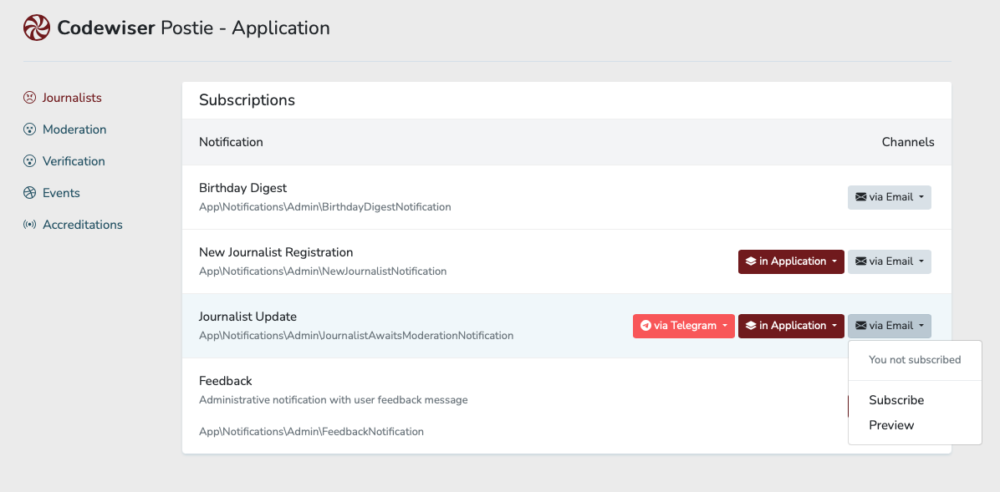

# Postie

Postie is a dashboard where users can manage their subscription preferences.

* [Installation](#installation)
* [Configuration](#configuration)
    * [Subscriptions](#subscription-definition)
    * [Channels](#channel-definition)
    * [Groups](#grouping-subscriptions)
    * [Preview](#previewing-notifications)
* [Sending Notifications](#sending-notifications)

Every `Notification` in application has corresponding audience. It doesn't mean, that everyone from audience will receive a notification, but it is possible. So, Postie allows user to decide what channels he or she wants to be used to deliver notification. 



## Installation

Install Postie into your project using the Composer package manager:

    composer require codewiser/postie

After installing Postie, publish its assets using the `postie:install` Artisan command:

    php artisan postie:install

Before running migrations you may want to change name of the table, that keeps user subscription preferences. Then see `config/postie.php`.

```php
'table' => env('POSTIE_TABLE', 'subscriptions'),
```

After you configured table name run migrations:

    php artisan migrate

## Configuration

After installing Postie, its service provider will be located at `App\Proviers\PostieServiceProvider`.

First, provide information about every `Notification`, that users may manage. Every subscription requires list of available channels and possible audience (as builder).

```php
use Codewiser\Postie\Subscription;
use Codewiser\Postie\PostieApplicationServiceProvider;

class PostieServiceProvider extends PostieApplicationServiceProvider
{
public function notifications(): array
    {
        return [
            Subscription::to(NewOrderNotification::class)
                ->via('mail', 'database')
                ->for(fn() => User::query()->where('role', 'sales-manager'))
        ];
}
```

Second, replace `Notification::via()` method with `\Codewiser\Postie\Notifications\Traits\Channelization` trait. `Notification` will use list of channels defined in associated `Subscription`.

```php
namespace App\Notifications;

use Illuminate\Bus\Queueable;
use Illuminate\Contracts\Queue\ShouldQueue;
use Illuminate\Notifications\Notification;
use Codewiser\Postie\Notifications\Traits\Channelization;

class NewOrderNotification extends Notification implements ShouldQueue
{
    use Queueable, Channelization;

    public function __construct(public Order $order)
    {
        //
    }

    public function toMail($notifiable)
    {
        return (new MailMessage)
            ->subject("New order")
            ->line('User makes new order.');
    }

    public function toArray($notifiable)
    {
        return $this->order->toArray();
    }
}
```

### Subscription Definition

`Subscription` is an object, that helps you describe application notification for Postie to understand.

Initially, it is enough to pass notification class name, query builder with users, who may receive such notification and channels list, supported by notification. 

```php
use Codewiser\Postie\Subscription;

Subscription::to(Notification::class)
    ->via('mail')
    ->for(fn() => User::query())
```

Moreover, you may define notification title and description.

```php
use Codewiser\Postie\Subscription;

Subscription::to(DailyNewsNotification::class)
    ->via('mail')
    ->for(fn() => User::query())
    ->title('Daily News Notification')
    ->description('Sends most interesting news digest')
```

### Channel Definition

When you set up `Subscription`, you may pass channel as a simple string. But there are a way to define more complex channel representation.

You may use `\Codewiser\Postie\Channel` object to describe channel with custom title, icon etc.:

```php
use Codewiser\Postie\Channel;
use Codewiser\Postie\Subscription;

$mail = Channel::via('mail')
    ->icon('envelope')
    ->title('via email')
    ->subtitle('Sends emails');

Subscription::to(DailyNewsNotification::class)
    ->via($mail);
```

You may define default state of channel. If channel is active, then all users will receive notifications through this channel until they unsubscribe. Vice versa, if channel is passive, all users will not receive notifications via this channel until they subscribe to it.

Default channel state is active.

```php
use Codewiser\Postie\Channel;

$mail = Channel::via('mail')->passive();
```

If you want to disable user ability to manage channel preferences, you may hide channel form user interface, or just force channel state.

```php
use Codewiser\Postie\Channel;

$mail = Channel::via('database')->hidden();
```

```php
use Codewiser\Postie\Channel;

$mail = Channel::via('mail')->active()->forced();
```

### Grouping Subscriptions

You may group subscriptions to create side menu for dashboard. Subscriptions inherit channels and audience form a group, if defined.

```php
use Codewiser\Postie\Group;
use Codewiser\Postie\Subscription;

Group::make('My group')
    ->icon('broadcast')
    ->via('mail', 'database')
    ->for(fn() => User::query())
    ->add(Subscription::to(DailyNewsNotification::class)
    ->add(Subscription::to(NewOrderNotification::class)
```

### Previewing Notifications

You may define notification preview. So user can see how notification will be looks like.

Notification preview may be composed with model factories...

```php
use Codewiser\Postie\Subscription;

Subscription::to(DailyNewsNotification::class)
    ->via('email')
    ->for(fn() => User::query())
    ->preview(function(string $channel, $notifiable) {
        
        $news = NewsItem::factory()->count(3)->make();
        
        $notification = new DailyNewsNotification($news);
        
        return match ($channel) {
            'mail' => $notification->toMail($notifiable),
            'telegram' => $notification->toTelegram($notifiable),
            'database', 'broadcast' => $notification->toArray($notifiable),
        };
    });
```

## Sending Notifications

Using Postie, you may simply send notification without defining notifiables, as Postie already knows subscribers.

```php
use Codewiser\Postie\Contracts\Postie;

class OrderController extends Controller
{
    public function store(OrderStoreRequest $request, Postie $postie) 
    {
        $order = Order::create($request->validated());
        
        $postie->send(new NewOrderNotification($order));   
    }
}
```

If you need to limit notifiables, you may use a callback:

```php
use Codewiser\Postie\Contracts\Postie;

class OrderController extends Controller
{
    public function store(OrderStoreRequest $request, Postie $postie) 
    {
        $order = Order::create($request->validated());
        
        $postie->send(new NewOrderNotification($order), function($builder) use ($order) {
            if ($order->amount > 10) {
                return $builder->where('level', 'vip');
            } else {
                return $builder->whereNull('level');
            }
        });   
    }
}
```

You still may send notifications using `Facade` or `notify()` method. As `Notification` uses `Channelization` trait, it will respect user preferences.

```php
$user->notify(new NewOrderNotification($order));
```
