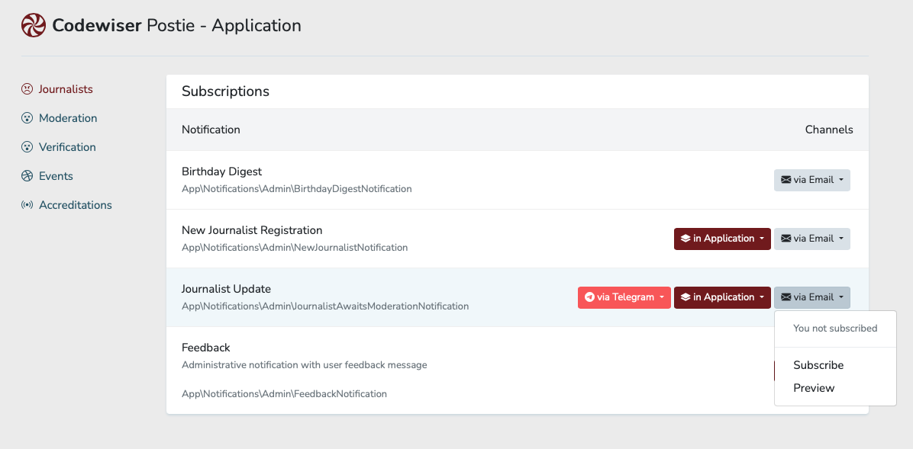

# Postie

Postie is a dashboard where users can manage their subscription preferences.

* [Installation](#installation)
* [Configuration](#configuration)
    * [Subscriptions](#subscription-object)
    * [Channels](#channel-object)
    * [Groups](#grouping-subscriptions)
    * [Preview](#previewing-notifications)
* [API](#api)

Every `Notification` in the application has a corresponding audience.
It doesn't mean that everyone in the audience will receive a notification,
but it is possible. Postie **allows the user to decide** which channels
should be used to deliver the notification.



## Installation

Install Postie into your project using the Composer package manager:

    composer require codewiser/postie

After installing Postie,
publish its resources (provider, assets, migrations) using the
`postie:install` Artisan command:

    php artisan postie:install

Before running migrations, you may want to change the name of the table
that keeps user subscription preferences. The configuration file is published
separately with Laravel's `vendor:publish` command:

    php artisan vendor:publish --tag=postie-config

Then see `config/postie.php`:

```php
'table' => env('POSTIE_TABLE', 'postie'),
```

After you have configured the table name, run migrations:

    php artisan migrate

To refresh Postie assets after an update, use the `postie:publish` Artisan command:

    php artisan postie:publish

Postie UI strings and the default group name are translatable.
Publish Postie translations to override them:

    php artisan vendor:publish --tag=postie-translations

## Configuration

After installing Postie, its service provider will be
located at `App\Providers\PostieServiceProvider`. Do not forget to register 
it in the list of service providers.

Postie can discover notifications automatically:
any notification class in the `app/Notifications` directory that applies the
`Channel(s)` or `Group(s)` attribute is registered on its own.

To use a different directory, publish the `postie` config and set the
`notifications_path` option to an array of directories.

Replace the `Notification::via()` method with the
`\Codewiser\Postie\Notifications\Traits\Channelization` trait.
The `Notification` will use the delivery channels the user preferred.

```php
namespace App\Notifications;

use Codewiser\Postie\Attributes\Channel;
use Illuminate\Notifications\Notification;
use Codewiser\Postie\Notifications\Traits\Channelization;

#[Channel('mail')]
class DailyNewsNotification extends Notification
{
    use Channelization;
}
```

Class-level attributes are not inherited from a parent class: apply them 
to each Notification that must use them.

> This is a minimal setup. All of the following is mostly about making
the Web panel beautiful.

### Subscription Object

Initially, it is enough to provide a list of channels supported by the 
notification. Additionally, you may define a notification subject and description.

```php
namespace App\Notifications;

use Codewiser\Postie\Attributes\Channel;
use Codewiser\Postie\Attributes\Description;
use Codewiser\Postie\Attributes\Subject;
use Illuminate\Notifications\Notification;
use Codewiser\Postie\Notifications\Traits\Channelization;

#[Subject('Daily News Notification')]
#[Description('Sends most interesting news digest')]
#[Channel('mail')]
class DailyNewsNotification extends Notification
{
    use Channelization;
}
```

If you don't like PHP attributes, or if you need a translatable
title/description, define subscriptions in `PostieServiceProvider` explicitly.
You may combine both approaches: notification attributes take precedence.

```php
use Codewiser\Postie\Subscription;
use Codewiser\Postie\PostieApplicationServiceProvider;

class PostieServiceProvider extends PostieApplicationServiceProvider
{
    public function notifications(): array
    {
        return [
            Subscription::to(DailyNewsNotification::class)
                ->via('mail')
                ->title(__('Daily News Notification'))
                ->description(__('Sends most interesting news digest')),
        ];
    }
}
```

### Channel Object

When you set up a `Subscription`, you may pass a channel as a simple string.
But there is a way to define a more complex channel representation.

You may use the `\Codewiser\Postie\Channel` object to describe a channel
with a custom title, icon, etc.

The easiest approach is to describe all available channels in the Service
Provider. Here you set up channel default properties. Later you may override
channel properties per notification.

```php
use Codewiser\Postie\Channel;
use Codewiser\Postie\PostieApplicationServiceProvider;

class PostieServiceProvider extends PostieApplicationServiceProvider
{
    public function channels(): array
    {
        return [
            Channel::via('mail')
                ->icon('envelope')
                ->title(__('via email'))
                ->subtitle(__('Sends emails'))
                ->passive(),
        ];
    }
}
```

When a `Subscription` gets a channel by its name, the channel
definition inherits these default properties (title, icon, etc.)
unless they are overridden by the channel attribute or fluent method.
If a channel hasn't been described in the Service Provider,
it gets built-in defaults (title and icon derived from its name).

You may define the default state of a channel. If a channel is active, then
all users will receive notifications through it until they unsubscribe.
Conversely, if a channel is passive, users will not receive notifications
through it until they subscribe.

Default channel state is active.

```php
namespace App\Notifications;

use Codewiser\Postie\Attributes\Channel;
use Illuminate\Notifications\Notification;
use Codewiser\Postie\Notifications\Traits\Channelization;

#[Channel('mail', default: false)]
class DailyNewsNotification extends Notification
{
    use Channelization;
}
```

You may apply the same properties to a few channels at once using the
`Channels` attribute:

```php
use Codewiser\Postie\Attributes\Channels;

#[Channels(['mail', 'telegram'], default: false)]
class DailyNewsNotification extends Notification
{
    use Channelization;
}
```

If you want to disable the user's ability to manage channel preferences, you
may hide the channel from the user interface, or just force the channel state.

```php
namespace App\Notifications;

use Codewiser\Postie\Attributes\Channel;
use Illuminate\Notifications\Notification;
use Codewiser\Postie\Notifications\Traits\Channelization;

#[Channel('mail', forced: true)]
#[Channel('database', hidden: true)]
class DailyNewsNotification extends Notification
{
    use Channelization;
}
```

#### Channel availability

A channel is available to the user when the notifiable has a route to receive
notifications through it. Availability is resolved by the
`routeNotificationFor()` method — either a `routeNotificationFor{Channel}()`
method on the notifiable.

```php
namespace App\Models;

use Illuminate\Notifications\Notifiable;

class User extends Authenticatable
{
    use Notifiable;

    public function routeNotificationForTelegram(): ?string
    {
        return $this->telegram_chat_id;
    }
}
```

When a channel requires the user to enable a route (for example, connecting
a messenger account), give the channel a router URL:

```php
use Codewiser\Postie\Channel;
use Codewiser\Postie\PostieApplicationServiceProvider;

class PostieServiceProvider extends PostieApplicationServiceProvider
{
    public function channels(): array
    {
        return [
            Channel::via('telegram')->router(route('telegram.start_bot')),
        ];
    }
}
```

Postie will provide a **Configure** screen to the dashboard, so the user can 
enable it and start receiving notifications.

### Grouping Subscriptions

You may group subscriptions to create a side menu for the dashboard.

The easiest approach is to describe all groups in the service provider.
Here you set up group default properties (icon, weight, channels, audience).
Later a subscription may reference a group by its name and inherit these
properties.

```php
use Codewiser\Postie\Audience;
use Codewiser\Postie\Group;

public function groups(): array
{
    return [
        Group::make('My group')->via('mail', 'database')
    ];
}
```

In `notifications()` you may reference a predefined group by its name:

```php
use Codewiser\Postie\Subscription;

public function notifications(): array
{
    return [
        Subscription::to(DailyNewsNotification::class)->group('My group'),
        Subscription::to(NewOrderNotification::class)->group('My group'),
    ];
}
```

Or define a group right inside `notifications()`:

```php
public function notifications(): array
{
    return [
        // Define group and assign a few subscriptions to it.
        Group::make('My group')
            ->via('mail', 'database')
            ->add(DailyNewsNotification::class)
            ->add(Subscription::to(NewOrderNotification::class)),
    ];
}
```

When a subscription defines its own channels, those channels win: group
channels are ignored.

Also, you may assign a subscription to a group using the attribute applied 
to a notification.

```php
namespace App\Notifications;

use Codewiser\Postie\Attributes\Group;
use Illuminate\Notifications\Notification;
use Codewiser\Postie\Notifications\Traits\Channelization;

#[Group('Another group')]
class DailyNewsNotification extends Notification
{
    use Channelization;
}
```

To assign a notification to a few groups at once, use the `Groups` attribute:

```php
use Codewiser\Postie\Attributes\Groups;

#[Groups(['Daily', 'Weekly'])]
class DailyNewsNotification extends Notification
{
    use Channelization;
}
```

Subscriptions that are not assigned to any group fall into a special
**fallback group** (named "Other" by default, translatable).

### Audience

A notification may be scoped to an audience using the `Audience` attribute.

If the current user is not in the notification's audience, he or she cannot
manage the subscription to the notification. If an audience is not set,
it means that every user can manage the subscription to such a notification.

Predefine possible notifiables (audience) in the service provider.
Each audience has a name (a `BackedEnum` is supported), a title,
and a callback that returns a Builder of possible notifiables.

```php
use Codewiser\Postie\Audience;

public function audiences(): array
{
    return [
        Audience::make('managers', 'Managers')->with(
            fn() => User::query()->where('role', 'manager')
        ),
    ];
}
```

The subscription adopts the builder of the predefined audience, referenced
by its name.

```php
namespace App\Notifications;

use Codewiser\Postie\Attributes\Audience;
use Illuminate\Notifications\Notification;
use Codewiser\Postie\Notifications\Traits\Channelization;

#[Audience('managers')]
class ManagersDigestNotification extends Notification
{
    use Channelization;
}
```

A `Subscription` or a `Group` may also reference a predefined audience by
name, or accept an `Audience` object, via the `for()` method:

```php
use Codewiser\Postie\Audience;

public function notifications(): array
{
    return [
        // Reference a predefined audience by name.
        Subscription::to(DigestNotification::class)->for('managers'),

        // Or use an audience object.
        Subscription::to(ReportNotification::class)->for(
            Audience::make('managers', 'Managers')->with(
                fn() => User::query()->where('role', 'manager')
            )
        ),
    ];
}
```

When a subscription defines its own audience, that audience wins: group 
audiences are ignored. Otherwise, when the audience comes from groups, the 
notifiable must belong to every group audience.

### Previewing Notifications

You may define a notification preview so the user can see
how the notification will look.

Notification previews may be composed with model factories.

```php
use Codewiser\Postie\Subscription;

Subscription::to(DailyNewsNotification::class)
    ->preview(function (string $channel, object $notifiable) {

        $news = NewsItem::factory()->count(3)->make();

        $notification = new DailyNewsNotification($news);

        return match ($channel) {
            'mail'      => $notification->toMail($notifiable),
            'telegram'  => $notification->toTelegram($notifiable),
            default     => $notification->toArray($notifiable),
        };
    });
```

Alternatively, you may define the preview inside the Notification class.
Mark a static method with the `Preview` attribute — Postie will use it
to compose the preview.

```php
namespace App\Notifications;

use Codewiser\Postie\Attributes\Preview;
use Illuminate\Notifications\Notification;
use Codewiser\Postie\Notifications\Traits\Channelization;

class DailyNewsNotification extends Notification
{
    use Channelization;

    #[Preview]
    public static function preview(): callable
    {
        return function (string $channel, object $notifiable) {

            $news = NewsItem::factory()->count(3)->make();

            $notification = new static($news);

            return match ($channel) {
                'mail'      => $notification->toMail($notifiable),
                'telegram'  => $notification->toTelegram($notifiable),
                default     => $notification->toArray($notifiable),
            };
        };
    }
}
```

> The `Preview` attribute is inherited from parent classes of the
> notification.

Previews defined via the subscription `preview()` method take precedence
over the `Preview` attribute.

## API

Postie ships a REST API. You may implement your own subscription management 
system.

The API is **not** registered by default — you include the routes yourself,
so the core package stays free of any API footprint.

### Routing setup

Add a `register()` method to your `App\Providers\PostieServiceProvider`:

```php
use Illuminate\Support\Facades\Route;

public function register(): void
{
    parent::register();

    Route::group([
        'domain'     => config('postie.domain', null),
        'prefix'     => config('postie.path'),
        'middleware' => ['api', 'auth:sanctum'],
        'as'         => 'postie.',
    ], function () {
        $this->loadRoutesFrom(__DIR__.'/../../vendor/codewiser/postie/routes/api.php');
    });
}
```

### Documentation

Interactive OpenAPI documentation (Redoc) is served alongside the dashboard,
**without** any extra setup — the docs routes are part of the dashboard routes:

* `GET /postie/api` — the Redoc page.
* `GET /postie/api/openapi.yaml` — the OpenAPI specification itself.